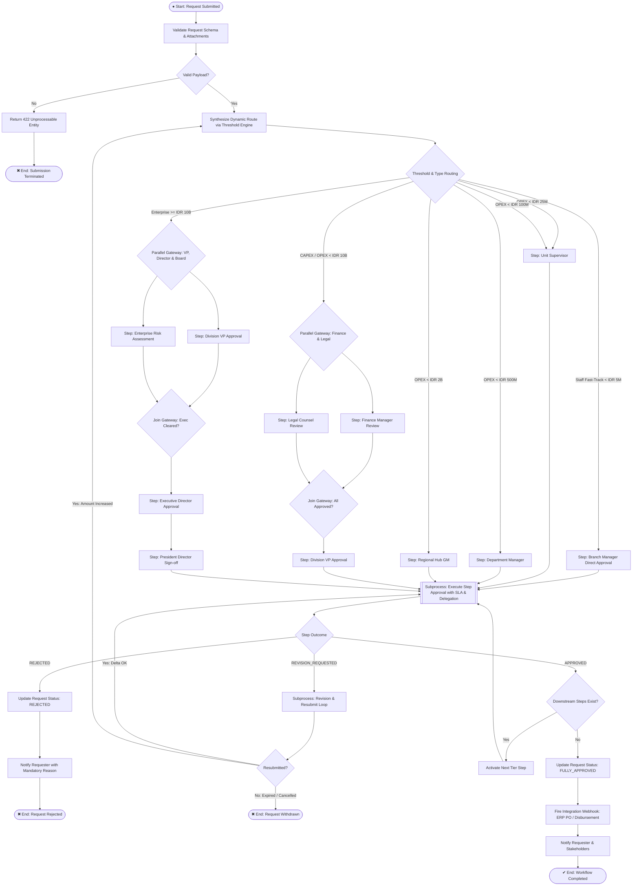
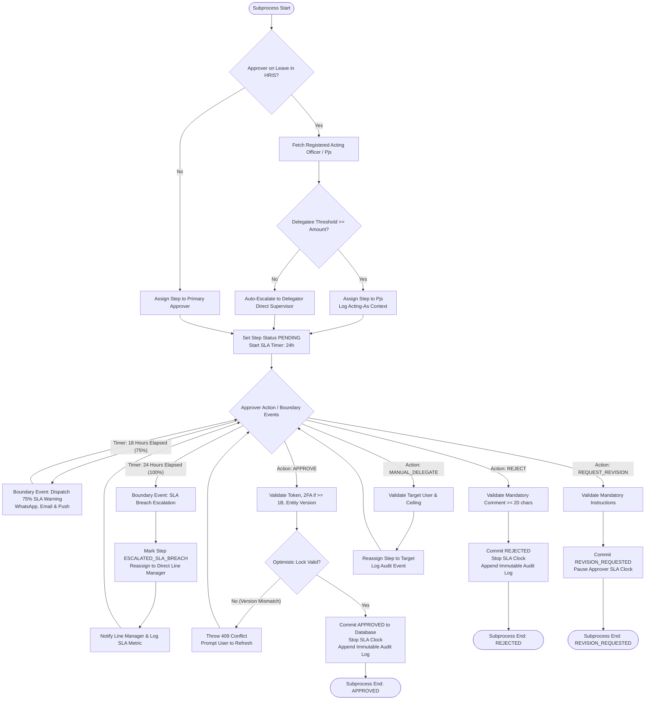
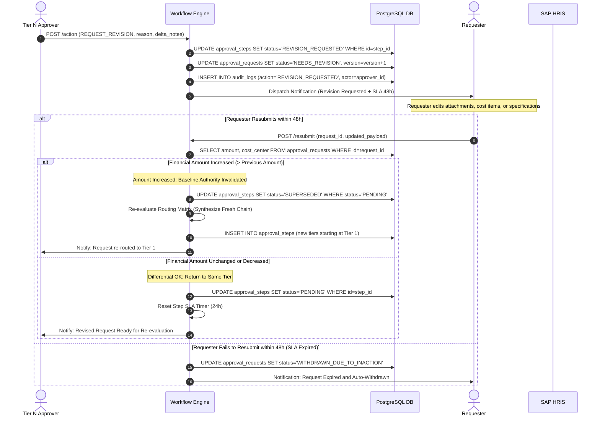
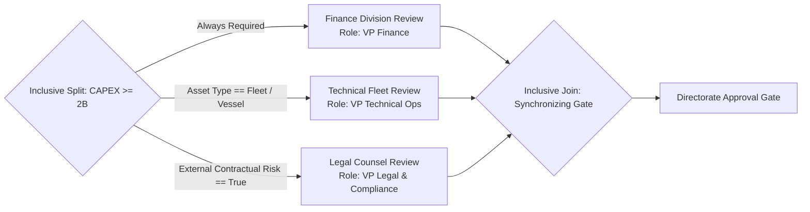
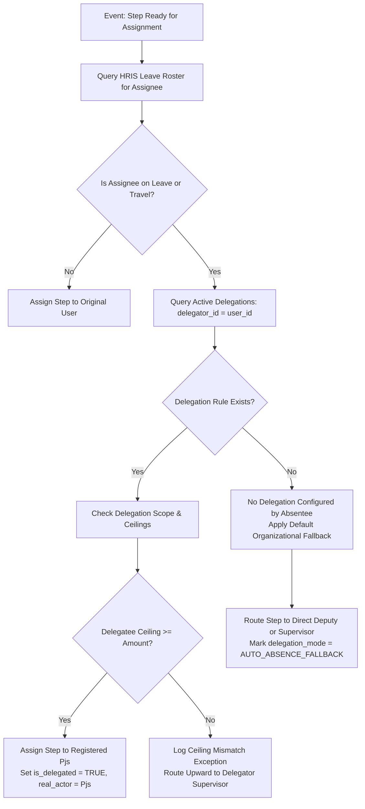

# BPMN 2.0 Process Flow & Workflow Orchestration Specification

## Project: Dynamic Multi-Tier Approval Workflow & Delegation Engine

| Field | Value |
| :--- | :--- |
| **Document Reference** | NT-SA-2026-ENG-002 |
| **Version** | 1.0.0 |
| **Target Enterprise** | PT Nusantara Transindo (Persero) |
| **Standard** | BPMN 2.0 (Business Process Model and Notation) |
| **Status** | Approved for Implementation |
| **Author** | Principal System Analyst & Enterprise Architecture Team |

---

## 1. Overview & BPMN 2.0 Architecture

This document formalizes the operational workflows of the **Dynamic Multi-Tier Approval Workflow & Delegation Engine** using BPMN 2.0 conventions. The process model spans five primary swimlanes representing key organizational participants and system components:

1. **Requester (Pool: Operational Units):** Branch staff, department officers, and engineers initiating requests.
2. **Approver Pool (Pool: Corporate Hierarchy):** Supervisors, Managers, GMs, VPs, Directors, and PresDir.
3. **Delegation Engine (Subsystem):** Automated component evaluating leave status and re-routing to Acting Officers (*Pelaksana Tugas / Pjs*).
4. **SLA & Escalation Daemon (Subsystem):** Asynchronous background worker monitoring tier timers, early warnings, and auto-escalations.
5. **ERP & Downstream Core (External System):** SAP ERP, Treasury, General Ledger, and Fleet Management Core.

---

## 2. End-to-End Approval Orchestration Flow (BPMN 2.0)

### 2.1 Complete Workflow Diagram



---

## 3. Subprocess 1: Step Execution, SLA Monitoring & Delegation

Every individual tier step executes inside a standardized isolated subprocess containing Timer Boundary Events and Delegation Logic:

### 3.1 Subprocess BPMN Diagram



---

## 4. Subprocess 2: Revision and Resubmit Differential Loop

When an approver determines that a submission is incomplete or inaccurate, the workflow enters the **Revision & Resubmit Subprocess**:

### 4.1 Resubmit Sequence & Differential Routing



---

## 5. Gateway Taxonomy & Technical Routing Rules

### 5.1 Exclusive Gateways (XOR - Threshold Routing)

Exclusive gateways direct the execution token along exactly one outbound path based on the boolean evaluation of the request parameters:

| Gateway ID | Gateway Name | Inbound Conditions | Outbound Destination | Business Rationale |
| :--- | :--- | :--- | :--- | :--- |
| `GW_XOR_01` | Amount Threshold Branching | `request_type == 'PROC'` and `amount < 5_000_000` | Tier 1 Fast-Track (Branch Manager) | Minor operational expenses (< 5M IDR) fast-tracked to prevent logistical halt |
| `GW_XOR_02` | Mid-Tier OPEX Threshold | `request_type == 'PROC'` and `5M <= amount < 25M` | Tier 2 (Unit Supervisor) | Standard operational spares and fleet repair kits |
| `GW_XOR_03` | Department Threshold | `request_type == 'PROC'` and `25M <= amount < 100M` | Tier 3 (Branch / Dept Manager) | Substantial regional hub purchases |
| `GW_XOR_04` | Regional Hub Threshold | `request_type == 'PROC'` and `100M <= amount < 500M` | Tier 4 (Regional Hub GM) | Inter-branch transport contracts and facility leases |
| `GW_XOR_05` | Corporate Division Threshold | `request_type == 'PROC'` and `500M <= amount < 2B` | Tier 5 (Corporate VP) | Fleet tire bulk procurement, port cargo handling |
| `GW_XOR_06` | Board Authority Threshold | `amount >= 10_000_000_000` | Tier 7 (President Director & BOC) | Vessel acquisitions, major multimodal terminal construction |

### 5.2 Inclusive Gateways (OR - Parallel Multi-Disciplinary Approvals)

Inclusive gateways allow one or more parallel approval streams to execute simultaneously based on condition tags. A downstream synchronizing inclusive merge gateway joins the parallel executions:



- **Execution Semantics:** The inclusive merge gateway dynamically computes the number of active inbound tokens created during the split and blocks advancement until all active branches emit an `APPROVED` signal.
- **Fast-Fail Semantics:** If any active parallel branch emits a `REJECTED` signal, the inclusive join immediately triggers cancellation tokens for all sibling pending branches, transitioning the overall request to `REJECTED`.

---

## 6. Boundary Timer Events & SLA Auto-Escalation Engine

### 6.1 State Machine for SLA Management

```
[Step Activated] 
       │
       ▼
   (PENDING) ───[T + 18h]───► Dispatch SLA Warning Alert (Email + WA + Push)
       │
   [T + 24h] (SLA Expiration)
       │
       ▼
[ESCALATED_SLA_BREACH]
       │
       ├─► Look up Line Manager in HRIS
       ├─► Generate Escalated Step (Tier N preserved)
       └─► Re-route assigned_user_id to Line Manager
```

### 6.2 Escalation Matrix by Corporate Tier

| Breaching Approver Tier | Line Manager Fallback Target | Secondary Fallback (if Line Manager on Leave) | Notification Urgency |
| :--- | :--- | :--- | :--- |
| **Tier 2 (Supervisor)** | Department Manager | Assistant Manager | Moderate (Email + Mobile App) |
| **Tier 3 (Manager)** | General Manager (Regional Hub) | Senior Manager / Designated Pjs | High (WhatsApp + Email) |
| **Tier 4 (General Manager)** | Division Vice President | Corporate Director | Urgent (Direct SMS + WA + Push) |
| **Tier 5 (Vice President)** | Executive Director (C-Suite) | President Director | Critical (Executive Assistant Alert) |
| **Tier 6 (Director)** | President Director | Board of Commissioners Audit Committee | Immediate Executive Briefing |

---

## 7. Delegation Subprocess & Exception Handlers

### 7.1 Automated Delegation Logic Flowchart



---

## 8. BPMN Process Traceability & Verification

| Process Trace ID | Path Evaluated | Expected Final State | Validation Criterion |
| :--- | :--- | :--- | :--- |
| **TRACE-01** | Sub-5M fast track approval by Branch Manager | `FULLY_APPROVED` | 1 step generated, executed in < 2 hours |
| **TRACE-02** | 80M OPEX: Supervisor → Manager → GM; Manager requests revision; resubmitted with same amount | `FULLY_APPROVED` | Step resets to Manager without repeating Supervisor step |
| **TRACE-03** | 150M OPEX: GM on leave with Pjs configured; Pjs approves within 12 hours | `FULLY_APPROVED` | Step executed by Pjs; audit log contains both delegator and Pjs IDs |
| **TRACE-04** | 3B CAPEX: Parallel split (Finance + Legal); Finance approves, Legal rejects | `REJECTED` | Legal rejection terminates Finance branch immediately; request marked `REJECTED` |
| **TRACE-05** | 40M OPEX: Supervisor breaches 24h SLA | `ESCALATED_SLA_BREACH` | New step generated for Department Manager; breach count incremented for Supervisor |

---

*End of Document — NT-SA-2026-ENG-002 v1.0.0*
