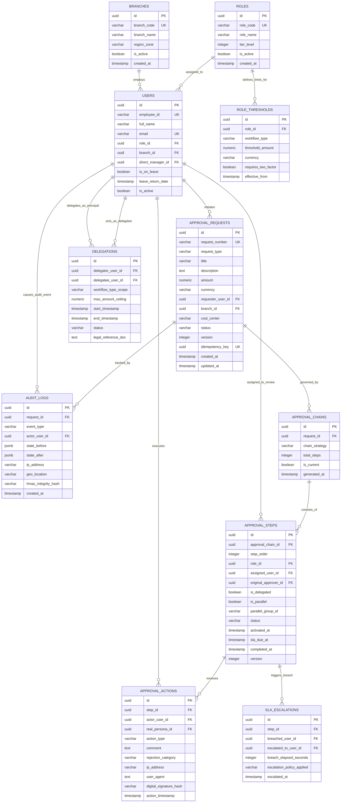

# Entity Relationship Diagram & Enterprise Data Dictionary

## Project: Dynamic Multi-Tier Approval Workflow & Delegation Engine

| Field | Value |
| :--- | :--- |
| **Document Reference** | NT-SA-2026-ENG-003 |
| **Version** | 1.0.0 |
| **Target Enterprise** | PT Nusantara Transindo (Persero) |
| **Database Engine** | PostgreSQL 16 Enterprise (with Row-Level Security & TimescaleDB extension for audit) |
| **Status** | Approved for Implementation |
| **Author** | Principal System Analyst & Lead Database Architect |

---

## 1. Schema Overview & Design Principles

The database schema for the Dynamic Multi-Tier Approval Workflow & Delegation Engine is engineered to adhere strictly to:
- **Third Normal Form (3NF):** Eliminating transitive and partial dependencies to maintain data integrity across distributed operational hubs.
- **ACID Transactional Guarantees:** Ensuring atomic step execution and zero state corruption during parallel approvals.
- **Audit Immutability:** Write-Once-Read-Many (WORM) compliant event logging with cryptographic verification hashes.
- **High Concurrency Protection:** Combining optimistic concurrency control (`version` incrementation) with pessimistic database row-locks (`FOR UPDATE NOWAIT`) to eliminate race conditions.

---

## 2. Mermaid Entity Relationship Diagram (ERD)



---

## 3. Comprehensive Data Dictionary

### 3.1 Table: `branches`
Stores master data for corporate logistics hubs and branch offices.

| Column Name | Data Type | Constraints | Default | Description |
| :--- | :--- | :--- | :--- | :--- |
| `id` | `UUID` | `PRIMARY KEY` | `gen_random_uuid()` | Unique surrogate identifier for branch |
| `branch_code` | `VARCHAR(20)` | `NOT NULL, UNIQUE` | None | Unique enterprise branch code (e.g., `BR-JKT-01`, `BR-SBY-02`) |
| `branch_name` | `VARCHAR(150)` | `NOT NULL` | None | Formal branch title (e.g., *Regional Hub Tanjung Priok*) |
| `region_zone` | `VARCHAR(50)` | `NOT NULL` | None | Operational corridor: `SUMATRA`, `JAVA`, `KALIMANTAN`, `SULAWESI`, `EAST_ID` |
| `address` | `TEXT` | `NULL` | None | Physical street address |
| `is_active` | `BOOLEAN` | `NOT NULL` | `TRUE` | Operational flag |
| `created_at` | `TIMESTAMPTZ` | `NOT NULL` | `NOW()` | Audit timestamp |

### 3.2 Table: `roles`
Defines enterprise authority levels mapped to the threshold matrix.

| Column Name | Data Type | Constraints | Default | Description |
| :--- | :--- | :--- | :--- | :--- |
| `id` | `UUID` | `PRIMARY KEY` | `gen_random_uuid()` | Unique role surrogate ID |
| `role_code` | `VARCHAR(50)` | `NOT NULL, UNIQUE` | None | Canonical role identifier: `STAFF`, `SUPERVISOR`, `MANAGER`, `GM`, `VP`, `DIRECTOR`, `PRESDIR` |
| `role_name` | `VARCHAR(100)` | `NOT NULL` | None | Human readable designation (e.g., *General Manager*) |
| `tier_level` | `INTEGER` | `NOT NULL, CHECK (tier_level BETWEEN 1 AND 7)` | None | Numerical hierarchy tier (1 = lowest, 7 = highest) |
| `is_active` | `BOOLEAN` | `NOT NULL` | `TRUE` | Role validity flag |
| `created_at` | `TIMESTAMPTZ` | `NOT NULL` | `NOW()` | Audit timestamp |

### 3.3 Table: `role_thresholds`
Contains financial delegation thresholds per role and workflow category.

| Column Name | Data Type | Constraints | Default | Description |
| :--- | :--- | :--- | :--- | :--- |
| `id` | `UUID` | `PRIMARY KEY` | `gen_random_uuid()` | Surrogate threshold identifier |
| `role_id` | `UUID` | `NOT NULL, REFERENCES roles(id)` | None | Role associated with authority limit |
| `workflow_type` | `VARCHAR(30)` | `NOT NULL, CHECK (workflow_type IN ('PROC','CAPEX','CR','HR'))` | None | Target approval category |
| `threshold_amount` | `NUMERIC(18,2)` | `NOT NULL` | None | Upper financial limit for single approval authority (IDR) |
| `currency` | `VARCHAR(3)` | `NOT NULL` | `'IDR'` | ISO 4217 Currency Code |
| `requires_two_factor`| `BOOLEAN` | `NOT NULL` | `FALSE` | Mandates TOTP / Biometrics challenge if `TRUE` |
| `effective_from` | `TIMESTAMPTZ` | `NOT NULL` | `NOW()` | Governance validity date |

### 3.4 Table: `users`
Enterprise user registry synchronized with SAP SuccessFactors.

| Column Name | Data Type | Constraints | Default | Description |
| :--- | :--- | :--- | :--- | :--- |
| `id` | `UUID` | `PRIMARY KEY` | `gen_random_uuid()` | Internal surrogate user identifier |
| `employee_id` | `VARCHAR(30)` | `NOT NULL, UNIQUE` | None | Corporate employee identification number (NPP) |
| `full_name` | `VARCHAR(150)` | `NOT NULL` | None | Full legal employee name |
| `email` | `VARCHAR(150)` | `NOT NULL, UNIQUE` | None | Corporate email address |
| `role_id` | `UUID` | `NOT NULL, REFERENCES roles(id)` | None | Base organizational role |
| `branch_id` | `UUID` | `NOT NULL, REFERENCES branches(id)` | None | Assigned base branch / hub |
| `direct_manager_id` | `UUID` | `NULL, REFERENCES users(id)` | None | Reporting line manager for escalations |
| `is_on_leave` | `BOOLEAN` | `NOT NULL` | `FALSE` | Active leave indicator synchronized via HRIS webhook |
| `leave_return_date`| `TIMESTAMPTZ` | `NULL` | None | Projected return date from official leave |
| `is_active` | `BOOLEAN` | `NOT NULL` | `TRUE` | Account active flag |
| `created_at` | `TIMESTAMPTZ` | `NOT NULL` | `NOW()` | Record creation timestamp |

### 3.5 Table: `delegations`
Stores active and scheduled authority delegations (*Pjs*).

| Column Name | Data Type | Constraints | Default | Description |
| :--- | :--- | :--- | :--- | :--- |
| `id` | `UUID` | `PRIMARY KEY` | `gen_random_uuid()` | Delegation policy ID |
| `delegator_user_id`| `UUID` | `NOT NULL, REFERENCES users(id)` | None | Primary approver delegating authority |
| `delegatee_user_id`| `UUID` | `NOT NULL, REFERENCES users(id)` | None | Acting officer (*Pjs*) receiving authority |
| `workflow_type_scope`| `VARCHAR(30)` | `NOT NULL` | `'ALL'` | Specific workflow category (`PROC`, `CAPEX`, etc.) or `ALL` |
| `max_amount_ceiling`| `NUMERIC(18,2)` | `NOT NULL` | None | Maximum allowable approval value for delegatee |
| `start_timestamp` | `TIMESTAMPTZ` | `NOT NULL` | None | Beginning of delegation effectiveness |
| `end_timestamp` | `TIMESTAMPTZ` | `NOT NULL` | None | Expiration of delegation |
| `status` | `VARCHAR(20)` | `NOT NULL, CHECK (status IN ('SCHEDULED','ACTIVE','REVOKED','EXPIRED'))` | `'SCHEDULED'` | Lifecycle state |
| `legal_reference_doc`| `TEXT` | `NULL` | None | Board Decree (*SK Direksi*) or assignment order number |

### 3.6 Table: `approval_requests`
Parent transactional table storing workflow instances.

| Column Name | Data Type | Constraints | Default | Description |
| :--- | :--- | :--- | :--- | :--- |
| `id` | `UUID` | `PRIMARY KEY` | `gen_random_uuid()` | Unique workflow request ID |
| `request_number` | `VARCHAR(50)` | `NOT NULL, UNIQUE` | None | Human readable document code (e.g., `PR-2026-JKT-00421`) |
| `request_type` | `VARCHAR(30)` | `NOT NULL, CHECK (request_type IN ('PROC','CAPEX','CR','HR'))` | None | Approval classification |
| `title` | `VARCHAR(255)` | `NOT NULL` | None | Short synopsis of expenditure / request |
| `description` | `TEXT` | `NOT NULL` | None | Comprehensive business justification |
| `amount` | `NUMERIC(18,2)` | `NOT NULL, CHECK (amount >= 0)` | `0.00` | Monetary valuation |
| `currency` | `VARCHAR(3)` | `NOT NULL` | `'IDR'` | Currency code |
| `requester_user_id`| `UUID` | `NOT NULL, REFERENCES users(id)` | None | Initiator of request |
| `branch_id` | `UUID` | `NOT NULL, REFERENCES branches(id)` | None | Originating branch location |
| `cost_center` | `VARCHAR(50)` | `NOT NULL` | None | ERP financial cost center allocation |
| `status` | `VARCHAR(30)` | `NOT NULL, CHECK (status IN ('DRAFT','IN_PROGRESS','NEEDS_REVISION','FULLY_APPROVED','REJECTED','WITHDRAWN'))` | `'DRAFT'` | Current workflow lifecycle state |
| `version` | `INTEGER` | `NOT NULL` | `1` | Optimistic concurrency locking counter |
| `idempotency_key` | `UUID` | `NOT NULL, UNIQUE` | None | Client submission deduplication UUID token |
| `created_at` | `TIMESTAMPTZ` | `NOT NULL` | `NOW()` | Submission timestamp |
| `updated_at` | `TIMESTAMPTZ` | `NOT NULL` | `NOW()` | Last state modification timestamp |

### 3.7 Table: `approval_chains`
Represents the generated routing plan for a request.

| Column Name | Data Type | Constraints | Default | Description |
| :--- | :--- | :--- | :--- | :--- |
| `id` | `UUID` | `PRIMARY KEY` | `gen_random_uuid()` | Chain configuration identifier |
| `request_id` | `UUID` | `NOT NULL, REFERENCES approval_requests(id)` | None | Associated request |
| `chain_strategy` | `VARCHAR(30)` | `NOT NULL` | `'SEQUENTIAL'` | `SEQUENTIAL`, `PARALLEL_JOIN`, `AD_HOC_MODIFIED` |
| `total_steps` | `INTEGER` | `NOT NULL` | None | Total count of steps in this iteration |
| `is_current` | `BOOLEAN` | `NOT NULL` | `TRUE` | Flag indicating if this is the active plan (false if re-routed) |
| `generated_at` | `TIMESTAMPTZ` | `NOT NULL` | `NOW()` | Generation timestamp |

### 3.8 Table: `approval_steps`
Atomic review step within an approval chain.

| Column Name | Data Type | Constraints | Default | Description |
| :--- | :--- | :--- | :--- | :--- |
| `id` | `UUID` | `PRIMARY KEY` | `gen_random_uuid()` | Step surrogate ID |
| `approval_chain_id`| `UUID` | `NOT NULL, REFERENCES approval_chains(id)` | None | Owning chain |
| `step_order` | `INTEGER` | `NOT NULL` | None | Sequential execution rank (1, 2, 3...) |
| `role_id` | `UUID` | `NOT NULL, REFERENCES roles(id)` | None | Target governance tier role required |
| `assigned_user_id`| `UUID` | `NOT NULL, REFERENCES users(id)` | None | Active user responsible for taking action |
| `original_approver_id`| `UUID`| `NULL, REFERENCES users(id)` | None | Original user before delegation or escalation |
| `is_delegated` | `BOOLEAN` | `NOT NULL` | `FALSE` | Indicates if acted upon by a delegatee |
| `is_parallel` | `BOOLEAN` | `NOT NULL` | `FALSE` | Indicates parallel execution tier |
| `parallel_group_id`| `VARCHAR(50)`| `NULL` | None | Identifier linking sibling parallel steps |
| `status` | `VARCHAR(30)` | `NOT NULL, CHECK (status IN ('PENDING','APPROVED','REJECTED','REVISION_REQUESTED','ESCALATED_SLA_BREACH','SUPERSEDED','CANCELLED'))` | `'PENDING'` | Step execution status |
| `activated_at` | `TIMESTAMPTZ` | `NULL` | None | Timestamp when step became active |
| `sla_due_at` | `TIMESTAMPTZ` | `NULL` | None | SLA deadline (activated_at + 24 business hours) |
| `completed_at` | `TIMESTAMPTZ` | `NULL` | None | Timestamp when action completed |
| `version` | `INTEGER` | `NOT NULL` | `1` | Optimistic lock token for step updates |

### 3.9 Table: `approval_actions`
Immutable journal of decisions executed on steps.

| Column Name | Data Type | Constraints | Default | Description |
| :--- | :--- | :--- | :--- | :--- |
| `id` | `UUID` | `PRIMARY KEY` | `gen_random_uuid()` | Action record ID |
| `step_id` | `UUID` | `NOT NULL, REFERENCES approval_steps(id)` | None | Executed step |
| `actor_user_id` | `UUID` | `NOT NULL, REFERENCES users(id)` | None | User who pressed the button |
| `real_persona_id` | `UUID` | `NOT NULL, REFERENCES users(id)` | None | Legal role authority being exercised (delegator or self) |
| `action_type` | `VARCHAR(30)` | `NOT NULL, CHECK (action_type IN ('APPROVE','REJECT','REQUEST_REVISION','MANUAL_DELEGATE'))` | None | Action verb |
| `comment` | `TEXT` | `NULL` | None | Decision justification (mandatory on Reject/Revise) |
| `rejection_category`| `VARCHAR(50)`| `NULL` | None | Categorical tag: `BUDGET_OVERRUN`, `INCOMPLETE_DOCS`, `POLICY_BREACH` |
| `ip_address` | `INET` | `NOT NULL` | None | Client network IP address |
| `user_agent` | `TEXT` | `NOT NULL` | None | Browser/Client HTTP User Agent |
| `digital_signature_hash`| `VARCHAR(128)`| `NOT NULL` | None | SHA-512 cryptographic hash of payload + actor key |
| `action_timestamp`| `TIMESTAMPTZ` | `NOT NULL` | `NOW()` | Exact commit timestamp |

### 3.10 Table: `sla_escalations`
Historical record of SLA breaches and automated routing adjustments.

| Column Name | Data Type | Constraints | Default | Description |
| :--- | :--- | :--- | :--- | :--- |
| `id` | `UUID` | `PRIMARY KEY` | `gen_random_uuid()` | Escalation event ID |
| `step_id` | `UUID` | `NOT NULL, REFERENCES approval_steps(id)` | None | Breached step |
| `breached_user_id`| `UUID` | `NOT NULL, REFERENCES users(id)` | None | Approver who failed to act within SLA |
| `escalated_to_user_id`| `UUID`| `NOT NULL, REFERENCES users(id)` | None | Target supervisor receiving escalation |
| `breach_elapsed_seconds`| `INTEGER` | `NOT NULL` | None | Actual elapsed seconds before escalation |
| `escalation_policy_applied`| `VARCHAR(50)`| `NOT NULL` | `'LINE_MANAGER_FALLBACK'` | Policy rule executed |
| `escalated_at` | `TIMESTAMPTZ` | `NOT NULL` | `NOW()` | Timestamp of automated escalation |

### 3.11 Table: `audit_logs`
WORM-compliant system-wide audit trail with tamper detection.

| Column Name | Data Type | Constraints | Default | Description |
| :--- | :--- | :--- | :--- | :--- |
| `id` | `UUID` | `PRIMARY KEY` | `gen_random_uuid()` | Audit entry UUID |
| `request_id` | `UUID` | `NOT NULL, REFERENCES approval_requests(id)` | None | Correlated request |
| `event_type` | `VARCHAR(50)` | `NOT NULL` | None | Event: `REQUEST_CREATED`, `STEP_APPROVED`, `AUTO_DELEGATED`, `SLA_BREACH` |
| `actor_user_id` | `UUID` | `NULL, REFERENCES users(id)` | None | Acting user (or NULL for system daemon) |
| `state_before` | `JSONB` | `NOT NULL` | None | Full JSON snapshot of entities before transition |
| `state_after` | `JSONB` | `NOT NULL` | None | Full JSON snapshot of entities after transition |
| `ip_address` | `INET` | `NULL` | None | Originating IP address |
| `geo_location` | `VARCHAR(100)`| `NULL` | None | City/Province derived via MaxMind GeoIP |
| `hmac_integrity_hash`| `VARCHAR(128)`| `NOT NULL` | None | HMAC-SHA256(previous_hash + payload + secret_key) |
| `created_at` | `TIMESTAMPTZ` | `NOT NULL` | `NOW()` | WORM timestamp |

---

## 4. Performance Indexes & Storage Optimization

```sql
-- Query Optimization for Workflow Engine
CREATE INDEX idx_requests_status_created ON approval_requests(status, created_at DESC);
CREATE INDEX idx_requests_requester ON approval_requests(requester_user_id, status);
CREATE INDEX idx_steps_assignee_status ON approval_steps(assigned_user_id, status) WHERE status = 'PENDING';
CREATE INDEX idx_steps_sla_active ON approval_steps(sla_due_at) WHERE status = 'PENDING';
CREATE INDEX idx_steps_parallel_lookup ON approval_steps(approval_chain_id, parallel_group_id) WHERE is_parallel = TRUE;
CREATE INDEX idx_delegations_active ON delegations(delegator_user_id, status, start_timestamp, end_timestamp);
CREATE INDEX idx_audit_request ON audit_logs(request_id, created_at ASC);
CREATE INDEX idx_audit_hash_chain ON audit_logs(created_at, hmac_integrity_hash);
```

---

## 5. Concurrency Control Architecture

To guarantee absolute data consistency across high-volume operational surges, the engine implements a hybrid concurrency control model.

### 5.1 Dual-Layer Locking Model

```
       Incoming Action Request
                 │
                 ▼
┌───────────────────────────────────┐
│ Layer 1: Redis Distributed Lock  │  (Key: "lock:step:{step_id}", TTL: 5s)
│ Prevents multi-pod execution      │
└─────────────────┬─────────────────┘
                  │ Acquired
                  ▼
┌───────────────────────────────────┐
│ Layer 2: PostgreSQL DB Lock      │  SELECT ... FROM approval_steps
│ Optimistic: WHERE version = :ver │  WHERE id = :step_id FOR UPDATE NOWAIT;
│ Pessimistic: Row-level lock      │
└─────────────────┬─────────────────┘
                  │ Committed
                  ▼
          State Transition OK
```

### 5.2 Implementation 1: Database Optimistic Locking Pattern

Optimistic locking is verified on every state mutation. If another thread commits first, the `UPDATE` affects 0 rows, which triggers a `ConcurrencyConflictException`:

```sql
-- Optimistic Locking Execution Block
UPDATE approval_steps
SET 
    status = 'APPROVED',
    completed_at = NOW(),
    version = version + 1
WHERE 
    id = :target_step_id 
    AND status = 'PENDING' 
    AND version = :client_expected_version;

-- If rows_affected == 0:
-- Engine rolls back transaction and throws 409 Conflict:
-- "Step was updated by another user. Please refresh and review latest state."
```

### 5.3 Implementation 2: Pessimistic Row Lock (`SELECT FOR UPDATE NOWAIT`)

When parallel approvers in a shared pool attempt an action simultaneously:

```sql
BEGIN TRANSACTION ISOLATION LEVEL READ COMMITTED;

-- Acquire exclusive row lock immediately; fail fast without blocking connection pool
SELECT id, status, version, assigned_user_id 
FROM approval_steps 
WHERE id = :target_step_id 
FOR UPDATE NOWAIT;

-- Perform business validations
-- 1. Validate status == 'PENDING'
-- 2. Validate current_user has active authorization or valid delegation
-- 3. Write approval action record
INSERT INTO approval_actions (
    id, step_id, actor_user_id, real_persona_id, 
    action_type, ip_address, user_agent, digital_signature_hash
) VALUES (
    gen_random_uuid(), :target_step_id, :actor_id, :persona_id,
    'APPROVE', :ip_addr, :user_agent, :signature_hash
);

-- Advance Step
UPDATE approval_steps 
SET status = 'APPROVED', completed_at = NOW(), version = version + 1
WHERE id = :target_step_id;

COMMIT;
```

### 5.4 Implementation 3: Python/SQLAlchemy Concurrency Handler

```python
from sqlalchemy.orm import Session
from sqlalchemy import select
from sqlalchemy.exc import DBAPIError
from fastapi import HTTPException, status

def execute_step_approval(
    db: Session, 
    step_id: str, 
    actor_id: str, 
    expected_version: int, 
    idempotency_key: str
):
    # Check Idempotency Cache
    cached_response = redis_client.get(f"idempotency:{idempotency_key}")
    if cached_response:
        return json.loads(cached_response)

    try:
        # Acquire pessimistic row lock with NOWAIT
        stmt = (
            select(ApprovalStep)
            .where(ApprovalStep.id == step_id)
            .with_for_update(nowait=True)
        )
        step = db.execute(stmt).scalar_one_or_none()

        if not step:
            raise HTTPException(status_code=404, detail="Step not found")

        if step.status != "PENDING":
            raise HTTPException(
                status_code=status.HTTP_409_CONFLICT,
                detail=f"Step is not pending (current state: {step.status})"
            )

        # Verify Optimistic Version
        if step.version != expected_version:
            raise HTTPException(
                status_code=status.HTTP_409_CONFLICT,
                detail="Concurrent modification detected. Please refresh."
            )

        # Transition Step State
        step.status = "APPROVED"
        step.completed_at = datetime.utcnow()
        step.version += 1

        # Commit Transaction
        db.commit()

        response = {"status": "SUCCESS", "step_id": step_id, "new_version": step.version}
        redis_client.setex(f"idempotency:{idempotency_key}", 300, json.dumps(response))
        return response

    except DBAPIError as e:
        db.rollback()
        # 55P03 is PostgreSQL code for lock_not_available
        if "could not obtain lock on row" in str(e):
            raise HTTPException(
                status_code=status.HTTP_409_CONFLICT,
                detail="Another approver is currently acting on this step."
            )
        raise
```

---

*End of Document — NT-SA-2026-ENG-003 v1.0.0*
