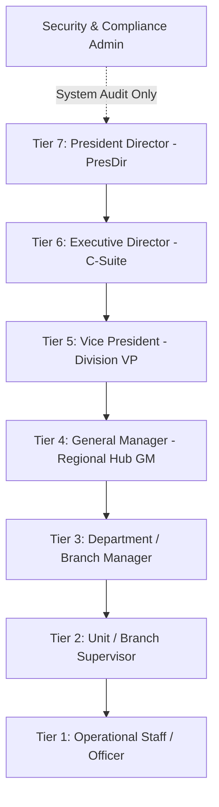
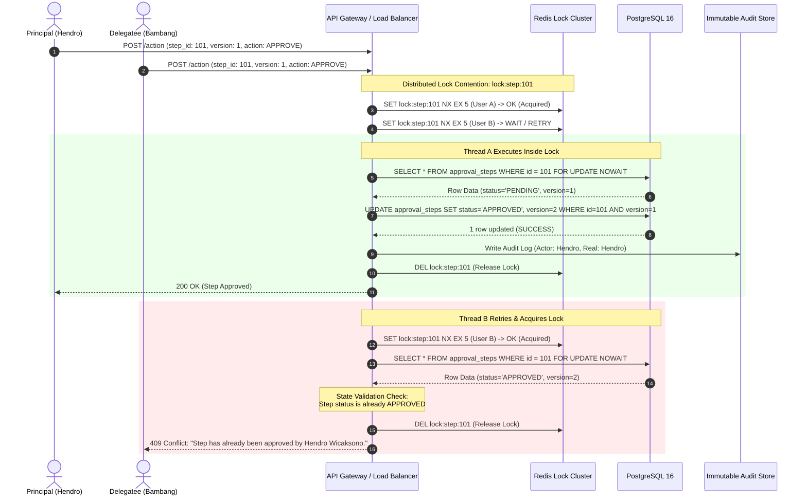

# RBAC, Delegation & Audit Governance Specification

## Project: Dynamic Multi-Tier Approval Workflow & Delegation Engine

| Field | Value |
| :--- | :--- |
| **Document Reference** | NT-SA-2026-ENG-004 |
| **Version** | 1.0.0 |
| **Target Enterprise** | PT Nusantara Transindo (Persero) |
| **Compliance Standards** | ISO 27001:2022, BUMN Cybersecurity Maturity, BPK Audit Guidelines |
| **Status** | Approved for Implementation |
| **Author** | Principal System Analyst & Enterprise Security Architect |

---

## 1. Executive Summary & Access Control Architecture

The **Dynamic Multi-Tier Approval Workflow & Delegation Engine** employs a hybrid access control model combining:
- **Hierarchical Role-Based Access Control (RBAC):** Governing default operational permissions, tier authority, and spending ceilings.
- **Attribute-Based Access Control (ABAC):** Dynamically evaluating real-time contextual attributes including document monetary value, operational cost center, branch jurisdiction, and active HRIS leave status.
- **Acting Persona Delegation (Pjs):** Enabling time-bounded, auditable authority transfer with rigorous upward escalation safeguards.
- **Cryptographic Audit Governance:** Ensuring non-repudiation through immutable forensic capture of dual-identity actions.

---

## 2. Enterprise Role Hierarchy & Permission Matrix

### 2.1 Role Hierarchy Definition



### 2.2 Granular Permission Matrix

| Permission Code | Permission Description | Tier 1 (Staff) | Tier 2 (Supervisor) | Tier 3 (Manager) | Tier 4 (GM) | Tier 5 (VP) | Tier 6 (Director) | Tier 7 (PresDir) | System Admin |
| :--- | :--- | :---: | :---: | :---: | :---: | :---: | :---: | :---: | :---: |
| `REQ_CREATE` | Create & Draft Requests | ✔ | ✔ | ✔ | ✔ | ✔ | ✖ | ✖ | ✖ |
| `REQ_SUBMIT` | Submit for Approval | ✔ | ✔ | ✔ | ✔ | ✔ | ✖ | ✖ | ✖ |
| `REQ_WITHDRAW`| Withdraw Unactioned Request | ✔ | ✔ | ✔ | ✔ | ✔ | ✖ | ✖ | ✖ |
| `REQ_VIEW_OWN`| View Own Submissions | ✔ | ✔ | ✔ | ✔ | ✔ | ✔ | ✔ | ✖ |
| `REQ_VIEW_ALL`| View All Branch / Hub Requests | ✖ | Branch | Branch | Region | Corporate | Enterprise | Enterprise | Read-Only |
| `ACT_APPROVE` | Approve within Threshold | ✖ | < 25M | < 100M | < 500M | < 2B | < 10B | Unlimited | ✖ |
| `ACT_REJECT`  | Reject Request | ✖ | ✔ | ✔ | ✔ | ✔ | ✔ | ✔ | ✖ |
| `ACT_REVISE`  | Request Revision | ✖ | ✔ | ✔ | ✔ | ✔ | ✔ | ✔ | ✖ |
| `ACT_DELEGATE`| Delegate Authority (*Pjs*) | ✖ | ✔ | ✔ | ✔ | ✔ | ✔ | ✔ | ✖ |
| `ACT_ADHOC`   | Insert Ad-hoc Reviewer | ✖ | ✖ | ✖ | ✔ | ✔ | ✔ | ✔ | ✖ |
| `ACT_BATCH`   | Batch Approval Action | ✖ | ✖ | ✖ | ✖ | ✔ | ✔ | ✔ | ✖ |
| `AUDIT_EXPORT`| Export Compliance Logs | ✖ | ✖ | ✖ | Hub | Division | Corporate | Enterprise | Full Access |
| `CFG_MATRIX`  | Modify Threshold Rules | ✖ | ✖ | ✖ | ✖ | ✖ | ✖ | ✖ | Two-Man Rule |

*Note: System Administrator accounts have strictly zero approval authority to prevent privilege escalation and segregation-of-duties (SoD) violations.*

---

## 3. Delegation Governance Rules (*Pelaksana Tugas / Pjs*)

Delegation in PT Nusantara Transindo is legally recognized under *Surat Keputusan Direksi tentang Pedoman Pelaksana Tugas*. The engine enforces deterministic rules governing authority transfer.

### 3.1 Allowed Delegation Vectors

```
[Eligible Delegations]
Tier N Approver ────► Peer Tier N (Same Division / Hub)           [ALLOWED]
Tier N Approver ────► Direct Subordinate Tier N-1 (Ceiling Capped) [ALLOWED]
Tier N Approver ────► External / Non-Reporting Staff              [FORBIDDEN]
Tier N Approver ────► Superior Tier N+1 (Use Escalation Instead)   [FORBIDDEN]
```

| Source Role | Permitted Delegatee Roles | Prerequisite Criteria | Maximum Duration | Approval Required? |
| :--- | :--- | :--- | :--- | :--- |
| **Tier 7 (PresDir)** | Tier 6 (Director) | Board Resolution (*Keputusan Direksi*) | 60 calendar days | Board of Commissioners |
| **Tier 6 (Director)** | Tier 6 (Peer Director) OR Tier 5 (Senior VP) | Formal Assignment Letter (*Surat Tugas*) | 30 calendar days | President Director |
| **Tier 5 (VP)** | Tier 5 (Peer VP) OR Tier 4 (Senior GM) | Departmental Notice | 21 calendar days | Division Director |
| **Tier 4 (GM Hub)** | Tier 4 (Peer GM) OR Tier 3 (Senior Branch Mgr) | Hub Assignment Memo | 14 calendar days | Division VP |
| **Tier 3 (Manager)** | Tier 3 (Peer Manager) OR Tier 2 (Sr. Supervisor) | Unit Notice | 14 calendar days | Hub GM |
| **Tier 2 (Supervisor)**| Tier 2 (Peer Supervisor) | Line Supervisor Approval | 7 calendar days | Branch Manager |
| **Tier 1 (Staff)** | *Not Applicable — No Approval Authority* | — | — | — |

### 3.2 Dynamic Ceiling Enforcement

When an authority is delegated downward (e.g., Tier 4 GM delegates to Tier 3 Manager):
1. **Default Ceiling Rule:** The delegatee operates under their **own natural threshold ceiling** (e.g., IDR 100M) unless an official decree (*SK Pjs*) explicitly grants a temporary limit upgrade.
2. **Ceiling Exceeded Upward Escalation:** If a request routed to the acting officer exceeds their authorized ceiling, the system automatically redirects the approval step upward to the **delegator's direct supervisor**:

$$\text{Effective Limit} = \min(\text{Delegator Threshold}, \text{Delegatee Authorized Ceiling})$$

$$\text{If } \text{Request Amount} > \text{Effective Limit} \implies \text{Route to Delegator.DirectManager}$$

### 3.3 Anti-Recursion & Chain Depth Rules
- **Maximum Delegation Depth = 2:**  
  User A $\to$ User B $\to$ User C is the maximum permissible transitive chain. User C is strictly prohibited from delegating further.
- **Circular Delegation Prohibition:**  
  Any attempt to establish a cyclic path (User A $\to$ User B $\to$ User A) is detected via graph cycle detection (Tarjan's algorithm) and rejected synchronously with `422 Unprocessable Entity`.
- **Automatic Revocation Trigger:**  
  When HRIS posts an event indicating the primary approver has checked back in from leave, all active delegation rules for that user are transitioned to `REVOKED` immediately, returning all pending steps to the primary assignee.

---

## 4. Forensic Audit Trail & "Who Approved as Whom" Specification

To satisfy BPK, BPKP, and ISO 27001 regulatory compliance, every action captures complete contextual forensics.

### 4.1 Dual-Identity Attribution Principle

When an acting officer (*Pjs*) approves a request on behalf of an absent executive:
- `actor_user_id`: The authenticated user physically interacting with the platform (e.g., Bambang Irawan - NPP 881023).
- `real_persona_id`: The institutional role authority being exercised (e.g., Acting VP of Procurement - NPP 750211).
- The audit record explicitly logs the operational assertion:  
  `"Bambang Irawan approved request PR-2026-00421 acting as Acting VP Procurement under Delegation SK-2026-042"`

### 4.2 Forensic Metadata Schema

```json
{
  "audit_event_id": "8f3b2a1c-7e4d-4b92-9a3d-1e5f8a7c2e01",
  "request_id": "3c9a1d2e-5b7f-4e8a-b1c3-6d8e2f4a5b7c",
  "step_id": "1b2c3d4e-5f6a-7b8c-9d0e-1f2a3b4c5d6e",
  "event_type": "ACTION_APPROVED_VIA_DELEGATION",
  "actors": {
    "authenticated_actor": {
      "user_id": "u-881023-bambang",
      "employee_id": "881023",
      "full_name": "Bambang Irawan",
      "role": "MANAGER_PROCUREMENT",
      "tier": 3
    },
    "delegated_principal": {
      "user_id": "u-750211-hendro",
      "employee_id": "750211",
      "full_name": "Hendro Wicaksono",
      "role": "VP_LOGISTICS_AND_SUPPLY",
      "tier": 5
    },
    "delegation_reference": {
      "delegation_id": "del-2026-0992",
      "legal_basis_doc": "SK.DIR/104/LOG/IX/2026",
      "effective_until": "2026-09-30T17:00:00+07:00"
    }
  },
  "forensic_context": {
    "timestamp": "2026-09-11T14:22:31.412+07:00",
    "ip_address": "10.42.18.95",
    "forwarded_for": "180.252.164.22",
    "geolocation": {
      "country": "ID",
      "city": "Surabaya",
      "region": "East Java",
      "isp": "PT Telkom Indonesia",
      "coordinates": [-7.2575, 112.7521]
    },
    "client_device": {
      "user_agent": "Mozilla/5.0 (Windows NT 10.0; Win64; x64) AppleWebKit/537.36 Chrome/128.0.0.0 Safari/537.36",
      "platform": "Windows 10 Enterprise",
      "device_type": "DESKTOP"
    },
    "two_factor_verification": {
      "method": "TOTP_HARD_TOKEN",
      "verified_at": "2026-09-11T14:22:28+07:00"
    }
  },
  "cryptographic_verification": {
    "action_payload_hash": "sha256:7e8b2c4d...",
    "previous_event_hash": "sha256:a1b2c3d4...",
    "hmac_signature": "hmac-sha256:9f8e7d6c5b4a...",
    "key_version": "2026-v1"
  }
}
```

### 4.3 Immutable Hash Chaining (WORM Mechanism)

Each audit entry computes an HMAC signature incorporating the previous record's hash, establishing an immutable cryptographic hash chain:

$$\text{Hash}_i = \text{HMAC-SHA256}(\text{SecretKey}, \text{Hash}_{i-1} \parallel \text{Payload}_i \parallel \text{Timestamp}_i)$$

Any unauthorized modification of historical database rows immediately breaks the chain validation checksum, raising an instant critical security alert to the SOC.

---

## 5. Concurrent Approval Protection & Race Condition Resolution

In enterprise logistics, multiple approvers or a principal and delegatee may open and review the same approval step simultaneously. Without robust concurrency safeguards, race conditions can corrupt workflow state.

### 5.1 Race Condition Scenarios & System Behavior

| Scenario | Participant A | Participant B | Time Delta | Outcome & System Behavior |
| :--- | :--- | :--- | :--- | :--- |
| **Scenario 1: Dual Parallel Approvers** | Finance Manager clicks `APPROVE` | Legal Counsel clicks `REJECT` | 50 ms | Both actions target separate parallel steps (`step_order` equal, distinct `parallel_group_id`). Step A marks `APPROVED`, Step B marks `REJECTED`. The join gateway detects `REJECTED` and triggers fast-fail cancellation for remaining steps. |
| **Scenario 2: Principal & Pjs Simultaneous Action** | Delegator (Hendro) clicks `APPROVE` | Delegatee (Bambang) clicks `APPROVE` | 10 ms | Both target the **exact same step ID**. Thread A acquires Redis distributed lock; Thread B waits. Thread A verifies `version = 1`, increments to `version = 2`, commits. Thread B acquires lock, inspects database, finds `status == 'APPROVED'`, immediately returns cached success with notice: *"Step already actioned."* |
| **Scenario 3: Conflicting Actions (Approve vs Revise)** | Approver clicks `APPROVE` | Co-approver clicks `REQUEST_REVISION` | 5 ms | Optimistic lock resolves race. First write to PostgreSQL commits; second write experiences `version` mismatch, throws `409 Conflict`. Second user sees dialog: *"Request was already updated by another approver. State refreshed."* |
| **Scenario 4: Author Resubmits during Approval** | Requester submits updated attachments | Approver clicks `APPROVE` | Concurrent | Database row lock on `approval_requests` serializes requests. If `RESUBMIT` commits first, step transitions to `SUPERSEDED`, approver's commit fails with `409 Conflict`. |

### 5.2 Concurrency Resolution Sequence Flow



### 5.3 Client-Side HTTP 409 Conflict Handling Contract

When the frontend client receives an HTTP 409 response, the application must execute the following structured remediation flow:

```typescript
// Frontend Concurrency Handler Specification
interface ConflictResponse {
  statusCode: 409;
  errorCode: "WORKFLOW_STEP_CONCURRENCY_CONFLICT";
  message: string;
  currentStepState: {
    status: "APPROVED" | "REJECTED" | "REVISION_REQUESTED";
    actionedBy: string;
    actionedAt: string;
    latestVersion: number;
  };
}

async function handleApprovalAction(stepId: string, actionPayload: ActionPayload) {
  try {
    const response = await apiClient.post(`/api/v1/approvals/steps/${stepId}/action`, actionPayload);
    showToastSuccess("Approval recorded successfully.");
    navigate("/dashboard/approvals");
  } catch (error) {
    if (error.response && error.response.status === 409) {
      const conflictData: ConflictResponse = error.response.data;
      
      // Prompt user with exact forensic detail
      showModal({
        title: "Action Already Executed",
        content: `This request step was already marked as ${conflictData.currentStepState.status} by ${conflictData.currentStepState.actionedBy} at ${conflictData.currentStepState.actionedAt}.`,
        confirmText: "Refresh View",
        onConfirm: () => {
          refreshCurrentRequestState(stepId);
        }
      });
    } else {
      showToastError("An unexpected system error occurred.");
    }
  }
}
```

---

## 6. Compliance Verification & Audit Certification Checklist

| Compliance Domain | Mandated Control | Technical Implementation | Verification Audit Tool |
| :--- | :--- | :--- | :--- |
| **Segregation of Duties (SoD)** | Requesters cannot approve their own submissions | SQL check: `requester_user_id != assigned_user_id` enforced at step creation and action API | Static code analysis & runtime assertion |
| **Non-Repudiation** | Approver cannot deny having executed approval | SHA-512 digital signature hash linking JWT token, payload, IP, and timestamp | Cryptographic signature validator script |
| **Tamper Proofing** | Audit logs cannot be modified by DBA or superuser | PostgreSQL Row-Level Security (RLS) + TimescaleDB append-only hypertable + WORM storage | Daily automated HMAC chain verification cron |
| **Least Privilege** | System Admin cannot execute approvals | Strict RBAC decoupling: Admin role lacks `ACT_APPROVE` permission | Penetration testing & IAM policy review |
| **High Value Verification** | Multi-factor challenge on transactions ≥ IDR 1B | TOTP verification filter injected into transaction commit boundary | Automated integration test suite |

---

*End of Document — NT-SA-2026-ENG-004 v1.0.0*
