# Change Request (CR) Governance & Route Evolution Specification

## Project: Dynamic Multi-Tier Approval Workflow & Delegation Engine

| Field | Value |
| :--- | :--- |
| **CR Reference Code** | CR-2026-ENG-DTO-009 |
| **Initiative Title** | Insertion of Digital Transformation Office (DTO) Governance Gate into IT & Capex Approval Chains |
| **Enterprise** | PT Nusantara Transindo (Persero) |
| **Target Go-Live** | October 1, 2026 — 00:00 WIB (Maintenance Window: 23:00 - 01:00 WIB) |
| **Author** | Principal System Analyst & IT Governance Committee |
| **Status** | Approved by Enterprise Architecture Board (EAB) & IT Steering Committee |

---

## 1. Change Request Profile & Business Justification

### 1.1 Executive Summary & Strategic Context

In alignment with the Ministry of BUMN Mandate on State-Owned Enterprise Digitalization and PT Nusantara Transindo's *Rencana Jangka Panjang Perusahaan (RJPP) 2025-2029*, the company has formally established the **Digital Transformation Office (DTO)** under the Directorate of Strategic Development & Technology.

Prior to this Change Request, IT procurement, cloud subscriptions, IoT fleet telematics, and digital logistics infrastructure were acquired under generic procurement rules without centralized architectural review. This led to:
- **Vendor & Technology Sprawl:** Duplicative software licenses and incompatible IoT hardware across Sumatra and Java hubs.
- **Cybersecurity & Compliance Vulnerabilities:** Cloud services procured without Enterprise Information Security Office (EISO) or DTO architecture clearance.
- **Budgetary Inefficiencies:** Absence of enterprise volume licensing discounts, costing an estimated **IDR 8.4 Billion** annually in lost economies of scale.

### 1.2 Proposed Change Scope

This Change Request formalizes the insertion of **Digital Transformation Office (DTO)** technical review gates into the workflow engine for:
1. **All CAPEX requests** containing digital, hardware, or telematics line items.
2. **All OPEX / Procurement requests** tagged with IT/Technology cost centers (`CC-IT-*`, `CC-DTO-*`) or exceeding **IDR 100,000,000**.
3. **Operational Change Requests (CR)** impacting core enterprise logistics software (ERP, TMS, WMS, Vessel Tracking).

---

## 2. Technical Scope & Architecture Adjustments

### 2.1 Rule Engine Schema Versioning

The dynamic routing engine utilizes versioned JSON Rule Sets stored in PostgreSQL and cached in Redis. This Change Request transitions the active rule set from `v1.2.0` to `v2.0.0`.

```json
{
  "rule_version": "2.0.0",
  "effective_from": "2026-10-01T00:00:00+07:00",
  "governance_rule_id": "RULE-DTO-GATE-01",
  "predicate": {
    "or": [
      { "field": "request_type", "equals": "CAPEX" },
      { "field": "cost_center", "starts_with": "CC-IT-" },
      { "field": "cost_center", "starts_with": "CC-DTO-" },
      {
        "and": [
          { "field": "request_type", "equals": "PROC" },
          { "field": "tags", "contains": "DIGITAL_TECH" },
          { "field": "amount", "gte": 100000000 }
        ]
      }
    ]
  },
  "route_modification": {
    "strategy": "PARALLEL_INCLUSIVE_INJECTION",
    "target_tier": 4,
    "inserted_role": "ROLE_DTO_ARCH_REVIEWER",
    "inserted_role_tier": 4,
    "sla_hours": 24,
    "escalation_target": "ROLE_VP_DIGITAL_TRANSFORMATION"
  }
}
```

### 2.2 New Roles & Authorization Hierarchy

Two new organizational roles are provisioned into the `roles` and `role_thresholds` tables:

| Role Code | Role Name | Tier Level | Approval / Review Limit | Can Delegate? |
| :--- | :--- | :---: | :--- | :---: |
| `ROLE_DTO_ARCH_REVIEWER` | DTO Lead Solutions Architect | Tier 4 (GM Level) | Technical Architectural Clearance (Non-Financial) | Yes (to Senior Enterprise Architect) |
| `ROLE_VP_DIGITAL_TRANSFORMATION` | Vice President Digital Transformation | Tier 5 (VP Level) | Up to IDR 2,000,000,000 (Financial & Technical) | Yes (to Senior DTO Lead) |

---

## 3. Impact Analysis on Existing Approval Routes

### 3.1 Route Topology Comparison: Pre vs. Post CR

```mermaid
flowchart TD
    subgraph Legacy_Route [Legacy Route: Fleet Telematics Capex 750M IDR]
        L1[Requester: Branch Logistics Engineer] --> L2[Tier 2: Hub Supervisor]
        L2 --> L3[Tier 3: Branch Manager]
        L3 --> L4[Tier 4: Regional Hub GM]
        L4 --> L5[Tier 5: VP Fleet Operations]
        L5 --> L6[Fully Approved -> PO Issued]
    end

    subgraph New_Route [New Target Route: v2.0.0]
        N1[Requester: Branch Logistics Engineer] --> N2[Tier 2: Hub Supervisor]
        N2 --> N3[Tier 3: Branch Manager]
        N3 --> N4[Parallel Inclusive Gateway]
        
        N4 --> N4A[Tier 4: Regional Hub GM<br/>Operational Feasibility]
        N4 --> N4B[Tier 4: DTO Lead Architect<br/>Technical & Security Standards]
        
        N4A --> N5[Parallel Synchronizing Join]
        N4B --> N5
        
        N5 --> N6[Tier 5: VP Fleet Operations]
        N6 --> N7[Fully Approved -> PO Issued]
    end
```



### 3.2 Quantitative Impact Metrics

| Dimension | Legacy Baseline | Post-CR Projection | Mitigation & Safeguards |
| :--- | :--- | :--- | :--- |
| **Total Route Steps** | 4 steps (Sequential) | 5 steps (4 tiers; Tier 4 split into 2 parallel reviewers) | Parallelization prevents lengthening sequential path |
| **Projected MTTA** | 3.2 business days | 3.6 business days (+0.4 days) | Standard 24h SLA enforced for DTO reviewers |
| **Review Bottleneck Risk** | Moderate | High (DTO reviewing for 50+ branches nationwide) | Provisioning pool of 4 rotating DTO Lead Architects with auto-assignment round-robin |
| **SLA Breach Exposure** | 3.8% historical | Projected 4.5% during first 30 days post-cutover | Automated 18h early warnings & auto-escalation to VP DTO |
| **ERP Integration Impact** | Zero schema change | Zero schema change (Payload metadata passes DTO sign-off token) | Regression tested against SAP RFC interfaces |

---

## 4. Migration Plan for In-Flight Approvals

A critical enterprise architectural challenge is handling requests already in-flight when the cutover occurs on October 1, 2026.

### 4.1 Grandfathering Policy vs. Active State Migration

PT Nusantara Transindo adopts a **Hybrid Grandfathering & State Injection Strategy**:

```
                              Active Request Evaluation at Cutover (T = 0)
                                                 │
                                                 ▼
                             ┌───────────────────────────────────────┐
                             │ Is Request Impacted by DTO Scope?     │
                             │ (CAPEX or IT Cost Center or Tech Tag) │
                             └───────────────────┬───────────────────┘
                                                 │
                         ┌───────────────────────┴───────────────────────┐
                         ▼                                               ▼
                      [ NO ]                                          [ YES ]
            Keep Existing Route                             Check Current Step Progress
            Execute on Rule v1.2.0                                       │
            (Grandfathered)                         ┌────────────────────┴────────────────────┐
                                                    ▼                                         ▼
                                          [ Already Past Tier 4 ]                   [ At or Before Tier 3 ]
                                          Allow to complete under v1.2.0            Dynamically Inject DTO Gate
                                          No retroactive blocking                   At Tier 4 via Migration Script
```

### 4.2 In-Flight Migration SQL Execution Script

The following transactional migration script executes during the cutover maintenance window:

```sql
-- Migration Script: NT-CR-2026-DTO-009-MIGRATE.sql
BEGIN TRANSACTION;

-- Step 1: Record Migration Cutover Execution in Audit Trail
INSERT INTO audit_logs (
    id, request_id, event_type, actor_user_id, 
    state_before, state_after, hmac_integrity_hash, created_at
) VALUES (
    gen_random_uuid(), NULL, 'SYSTEM_CR_CUTOVER_DTO_V2', NULL,
    '{"active_rule_version": "1.2.0"}'::jsonb,
    '{"active_rule_version": "2.0.0", "cr_reference": "CR-2026-ENG-DTO-009"}'::jsonb,
    'SYSTEM_HASH_MIGRATION_V2', NOW()
);

-- Step 2: Identify Active In-Flight Requests Eligible for DTO Gate Injection
-- Criteria: In-progress, Capex/IT Cost Center, current active step <= Tier 3
CREATE TEMP TABLE tmp_eligible_requests AS
SELECT 
    r.id AS request_id,
    c.id AS chain_id,
    MAX(s.step_order) AS current_max_step
FROM approval_requests r
JOIN approval_chains c ON c.request_id = r.id AND c.is_current = TRUE
JOIN approval_steps s ON s.approval_chain_id = c.id
WHERE r.status = 'IN_PROGRESS'
  AND (
      r.request_type = 'CAPEX' 
      OR r.cost_center LIKE 'CC-IT-%' 
      OR r.cost_center LIKE 'CC-DTO-%'
  )
  AND NOT EXISTS (
      -- Exclude if request has already passed Tier 4
      SELECT 1 FROM approval_steps past_s 
      JOIN roles past_r ON past_s.role_id = past_r.id 
      WHERE past_s.approval_chain_id = c.id 
        AND past_r.tier_level >= 4 
        AND past_s.status = 'APPROVED'
  )
GROUP BY r.id, c.id;

-- Step 3: Insert DTO Parallel Step for Eligible In-Flight Chains
INSERT INTO approval_steps (
    id, approval_chain_id, step_order, role_id, 
    assigned_user_id, is_delegated, is_parallel, parallel_group_id, 
    status, activated_at, sla_due_at, version
)
SELECT 
    gen_random_uuid(),
    t.chain_id,
    4, -- Tier 4 parallel step
    (SELECT id FROM roles WHERE role_code = 'ROLE_DTO_ARCH_REVIEWER'),
    -- Assign to default rotating DTO triage user
    (SELECT id FROM users WHERE email = 'dto.triage@nusantaratransindo.co.id'),
    FALSE,
    TRUE,
    'GRP-TIER4-PARALLEL',
    'PENDING',
    NOW(),
    NOW() + INTERVAL '24 HOURS',
    1
FROM tmp_eligible_requests t;

-- Step 4: Tag existing Hub GM step as parallel sibling in same group
UPDATE approval_steps
SET 
    is_parallel = TRUE,
    parallel_group_id = 'GRP-TIER4-PARALLEL'
WHERE approval_chain_id IN (SELECT chain_id FROM tmp_eligible_requests)
  AND role_id = (SELECT id FROM roles WHERE role_code = 'ROLE_REGIONAL_HUB_GM')
  AND status = 'PENDING';

COMMIT;
```

---

## 5. Comprehensive Rollback Strategy

An automated safety net is mandated. If unexpected operational bottlenecks, critical deadlocks, or routing failures occur within 48 hours post-deployment, the change can be rolled back immediately without downtime.

### 5.1 Rollback Trigger Criteria

A rollback to rule set `v1.2.0` is triggered if any of the following automated health thresholds are breached:
1. **Error Rate:** Workflow API 5xx errors exceed **0.5%** for > 5 consecutive minutes.
2. **SLA Breach Spike:** DTO tier SLA breach rate exceeds **15%** within the first 24 hours of cutover.
3. **Deadlock Detection:** PostgreSQL reports > 5 lock contention aborts in 1 hour on parallel join gateways.
4. **Executive Direct Order:** Pjs or Director of Technology issues formal rollback instruction.

### 5.2 Technical Rollback Execution (Zero-Downtime Feature Flag)

The routing engine dynamically evaluates the rule version from Redis configuration key `config:workflow:ruleset_version`. Rolling back does **not** require database schema teardown or service restarts:

```bash
# Emergency Rollback Execution via Redis CLI
# Toggles routing engine back to v1.2.0 instantaneously
redis-cli -h redis-cluster.internal -p 6379 \
  SET config:workflow:ruleset_version "1.2.0"

# Verify Key Propagation across Pods
redis-cli -h redis-cluster.internal -p 6379 \
  GET config:workflow:ruleset_version
```

### 5.3 Rollback In-Flight State Reconciliation Script

If rollback is activated, any pending DTO steps that have not yet been approved must be gracefully canceled without breaking parent request continuity:

```sql
-- Rollback In-Flight Reconciliation Script: NT-CR-2026-DTO-009-ROLLBACK.sql
BEGIN TRANSACTION;

-- Step 1: Mark pending DTO steps as CANCELLED_BY_ROLLBACK
UPDATE approval_steps
SET 
    status = 'CANCELLED',
    completed_at = NOW()
WHERE role_id = (SELECT id FROM roles WHERE role_code = 'ROLE_DTO_ARCH_REVIEWER')
  AND status = 'PENDING';

-- Step 2: Demote sibling parallel Hub GM steps back to standard sequential execution
UPDATE approval_steps
SET 
    is_parallel = FALSE,
    parallel_group_id = NULL
WHERE parallel_group_id = 'GRP-TIER4-PARALLEL'
  AND status = 'PENDING';

-- Step 3: Log Emergency Rollback Audit Record
INSERT INTO audit_logs (
    id, request_id, event_type, actor_user_id,
    state_before, state_after, hmac_integrity_hash, created_at
) VALUES (
    gen_random_uuid(), NULL, 'SYSTEM_EMERGENCY_ROLLBACK_DTO_V1', NULL,
    '{"active_rule_version": "2.0.0"}'::jsonb,
    '{"active_rule_version": "1.2.0", "reason": "SLA_BREACH_THRESHOLD_EXCEEDED"}'::jsonb,
    'SYSTEM_HASH_ROLLBACK_V1', NOW()
);

COMMIT;
```

---

## 6. Implementation Schedule & RACI Governance

### 6.1 Cutover Timeline (October 1, 2026)

| Time Window (WIB) | Activity Description | Owner | Output Artifact |
| :--- | :--- | :--- | :--- |
| **23:00 - 23:15** | Pre-flight database snapshot & Redis replication freeze | Lead DBA | Full pg_dump snapshot verified |
| **23:15 - 23:35** | Seed new DTO roles and threshold records | Lead SA / DBA | `roles` & `role_thresholds` verified |
| **23:35 - 23:55** | Execute in-flight migration script (`tmp_eligible_requests`) | Backend Tech Lead | In-flight steps injected |
| **23:55 - 00:05** | Deploy Rule Set v2.0.0 to Redis cluster | DevOps Lead | Redis cache warmed |
| **00:05 - 00:35** | End-to-end smoke test on staging & production canary | QA Lead | Synthetic test PR #99001 executed |
| **00:35 - 00:45** | Maintenance mode deactivated; system open to traffic | Release Manager | System Status: ONLINE |
| **08:00 - 17:00** | Day-1 Hypercare command center active | All Teams | Real-time SLA monitoring dashboard |

### 6.2 RACI Matrix

| Stakeholder Group | Responsible (R) | Accountable (A) | Consulted (C) | Informed (I) |
| :--- | :---: | :---: | :---: | :---: |
| **Enterprise Architecture Board** | | ✔ | ✔ | |
| **Principal System Analyst** | ✔ | | | |
| **Digital Transformation Office (DTO)**| ✔ | | ✔ | |
| **Regional Hub General Managers** | | | ✔ | ✔ |
| **Enterprise Security Office (EISO)** | | | ✔ | |
| **Database & DevOps Operations** | ✔ | | | |
| **End-User Logistics Staff** | | | | ✔ |

---

*End of Document — NT-CR-2026-ENG-DTO-009 v1.0.0*
